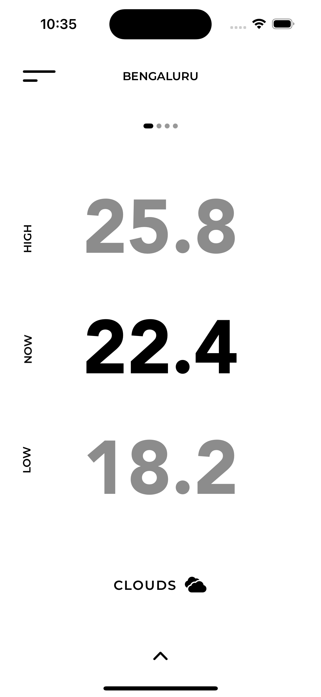
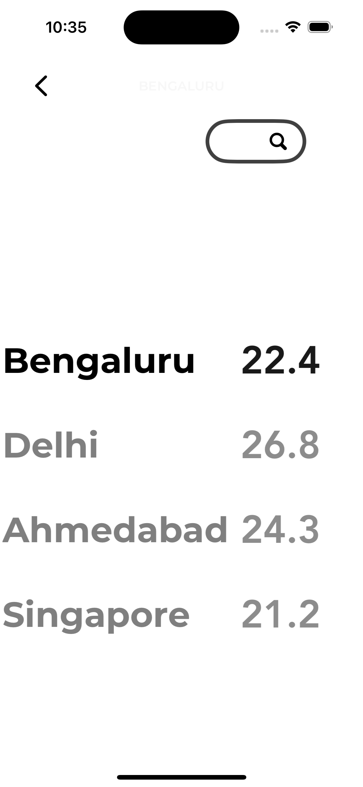
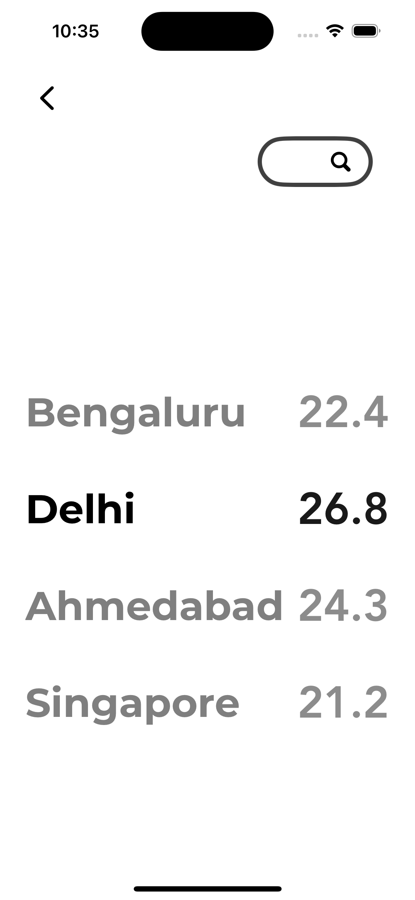
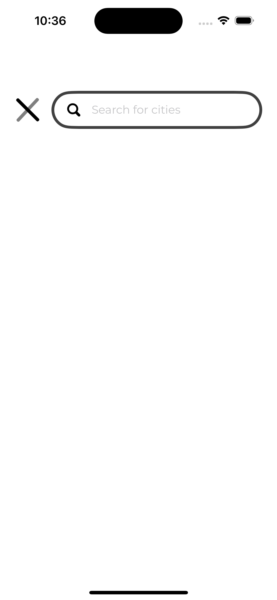

# Weather UI - SwiftUI

[](https://swift.org)
[](https://developer.apple.com/xcode/)

A beautiful and minimalistic Weather UI built using SwiftUI. This project demonstrates how to build a clean and modern weather interface with smooth animations and dynamic content, showcasing the power of SwiftUI for iOS app development.

## Features

- **Real-time Weather Data:** Fetches and displays real-time weather information.
- **Dynamic Backgrounds:** Background changes according to the current weather condition.
- **Smooth Animations:** Leverages SwiftUI's animation capabilities for a fluid user experience.
- **Modular Components:** Designed with reusable components for easy modification and scalability.
- **Responsive Design:** Optimized for various screen sizes including iPhone and iPad.

## Screenshots

| Home Screen | Weather Details |
|-------------|-----------------|
|  |  |  |  |


## Installation

To run this project on your local machine, follow these steps:

1. **Clone the repository:**

   ```bash
   git clone https://github.com/cronative/Weather_UI-SwiftUI.git
   cd Weather_UI-SwiftUI
